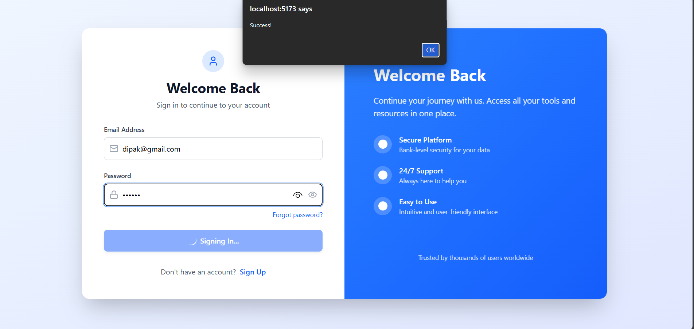
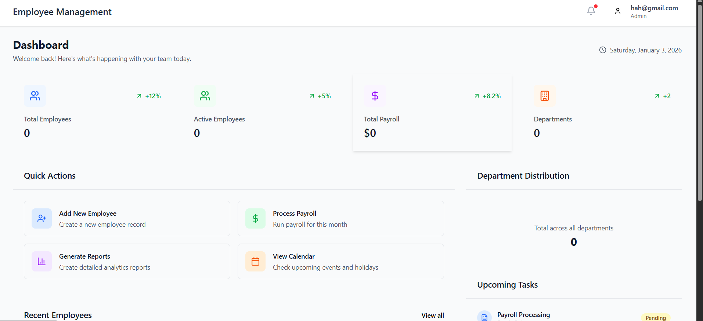
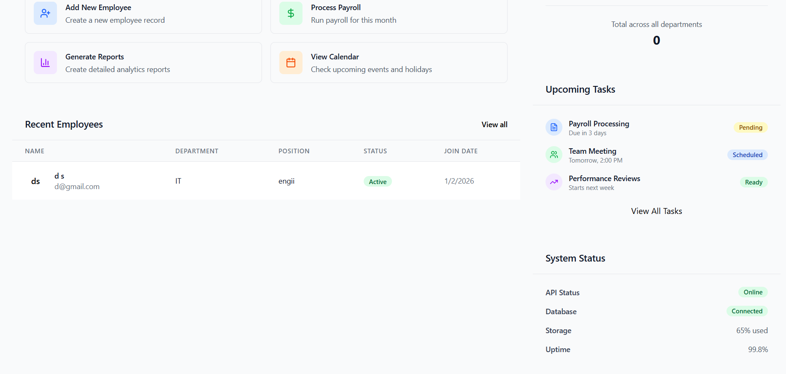
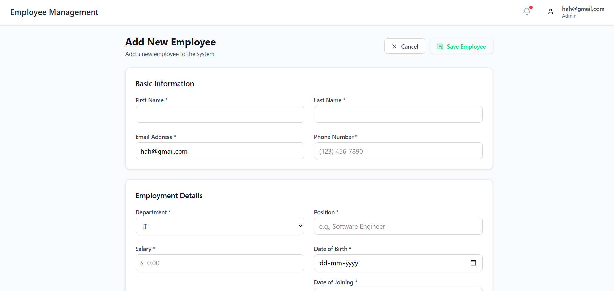
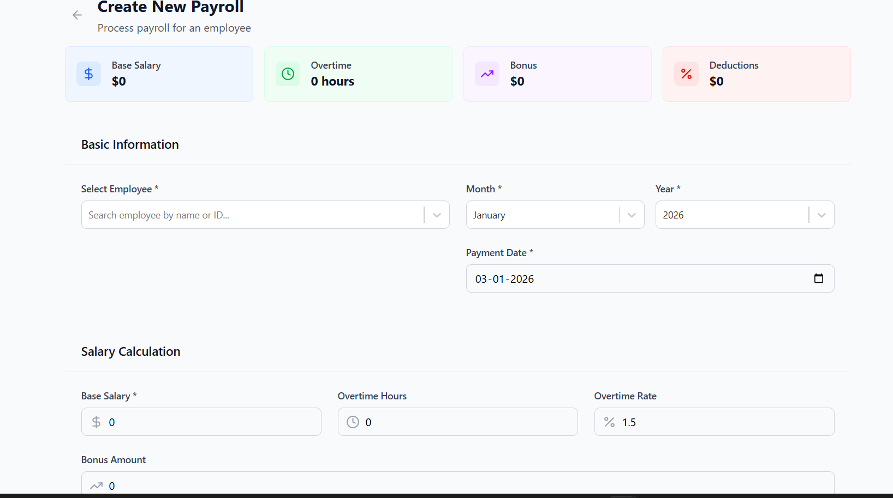
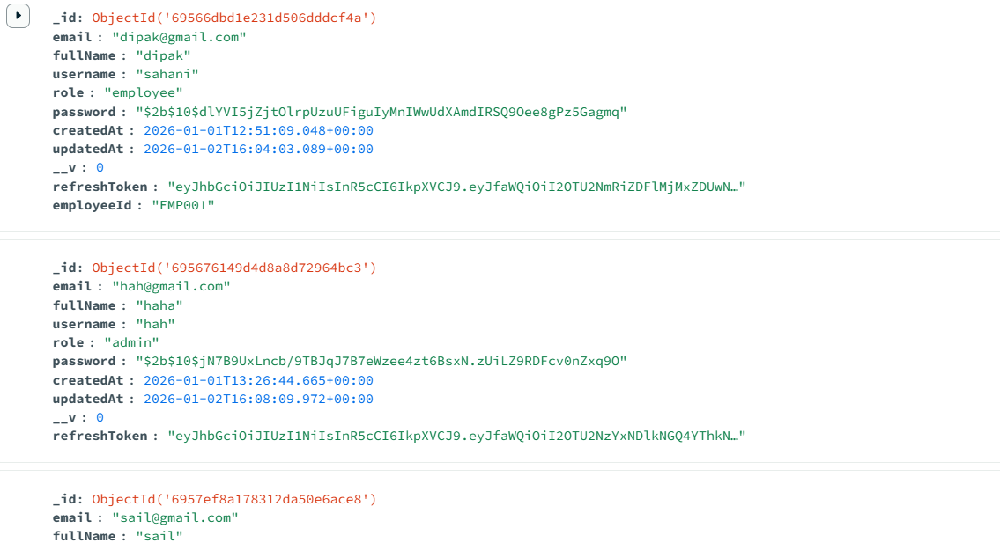
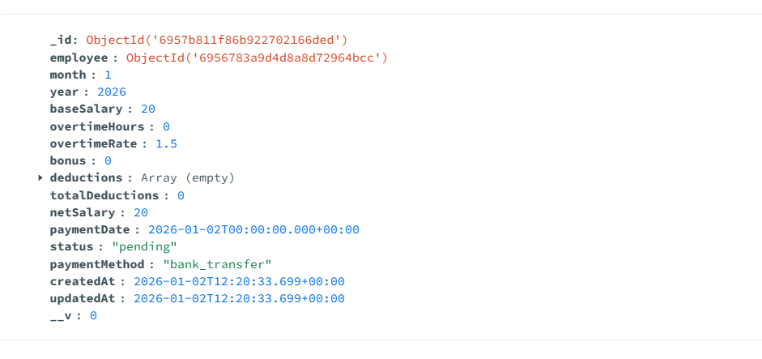
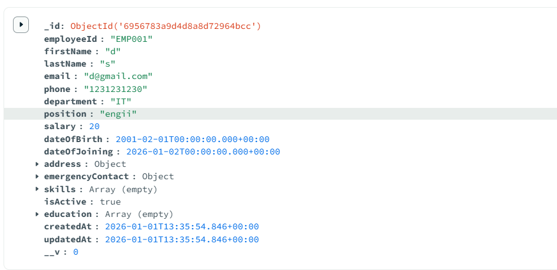

# Employee Management System (Full Stack)
### 📌 Project Overview

The Employee Management System (EMS) is a full-stack web application designed to manage employee records efficiently.
It provides role-based access where:

Admins can add, update, delete, and view all employee details.

Employees can log in, view their profile, and update limited personal information.

The application is built using React for the frontend, Node.js + Express for the backend, and MongoDB for database management.


### Demo












### 🛠 Tech Stack
Frontend

React.js

JavaScript (ES6+)

HTML5, CSS3

Axios (API communication)

React Router (Routing)

Backend

Node.js

Express.js

JWT (Authentication & Authorization)

bcrypt.js (Password hashing)

Database

MongoDB

Mongoose ODM

Tools

VS Code

Postman (API testing)

MongoDB Compass

Git & GitHub

### ✨ Features
Admin Features

Admin authentication (Login)

Add new employees

View all employees

Update employee details

Delete employee records

Role-based access control

Employee Features

Employee login

View personal profile

Update limited profile details (e.g., phone, address)

Common Features

Secure authentication using JWT

Password encryption using bcrypt

RESTful API architecture

Responsive UI (mobile & desktop friendly)

### 📂 Project Structure

```bash
Backend (/backend)
backend/
│── config/
│   └── db.js
│── controllers/
│   ├── authController.js
│   └── employeeController.js
│── models/
│   ├── User.js
│   └── Employee.js
│── routes/
│   ├── authRoutes.js
│   └── employeeRoutes.js
│── middleware/
│   ├── authMiddleware.js
│   └── roleMiddleware.js
│── .env
│── server.js
│── package.json
```

### 📂 Project Structure
```bash 

Frontend (/frontend)
frontend/
│── src/
│   ├── components/
│   ├── pages/
│   ├── services/
│   ├── App.js
│   ├── index.js
│── package.json

```

### 🗄 Database Schema (MongoDB)
```bash
User Collection
{
  name: String,
  email: String,
  password: String,
  role: { type: String, enum: ['admin', 'employee'] }
}

Employee Collection
{
  userId: ObjectId,
  department: String,
  designation: String,
  salary: Number,
  phone: String,
  address: String
}
```

### 🔐 API Endpoints
```bash
Authentication

POST /api/auth/register – Register user

POST /api/auth/login – Login user

Employee (Admin Only)

POST /api/employees – Add employee

GET /api/employees – Get all employees

PUT /api/employees/:id – Update employee

DELETE /api/employees/:id – Delete employee

Employee (Employee Access)

GET /api/employees/profile – View own profile

PUT /api/employees/profile – Update own profile
```
⚙️ Installation & Setup
1️⃣ Clone the Repository
git clone https://github.com/Dipak-sahani/BucketStudy-project.git

2️⃣ Backend Setup
```bash
cd backend
npm install
```

Create a .env file:

PORT=5000
MONGO_URI=your_mongodb_connection_string
JWT_SECRET=your_secret_key


Run backend server:

npm start

3️⃣ Frontend Setup
```bash
cd frontend
npm install
npm start
```
🧪 Testing

API tested using Postman

Frontend tested manually for responsiveness and role-based access

🚀 Deployment

Frontend: Deployed on Vercel / Netlify

Backend: Deployed on Render / Railway

Database: MongoDB Atlas

📸 Screenshots

Login Page

Admin Dashboard

Employee Profile Page
(Screenshots included in the submission folder)

💡 Bonus Feature (Optional)

Payroll Module

Dynamic salary calculation

Deductions and bonuses handling

Monthly payroll view

📦 Submission Includes

Backend source code

Frontend source code

MongoDB database dump

Screenshots of the application

README.md file

✅ Evaluation Highlights

Clean and modular code structure

Secure authentication and authorization

Responsive UI design

RESTful API implementation

Scalable and maintainable architecture

👨‍💻 Author

Dipak Sahani
Full Stack Developer (MERN)